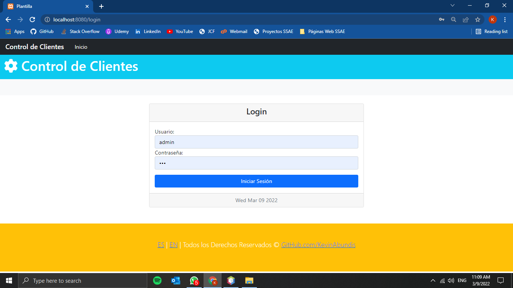
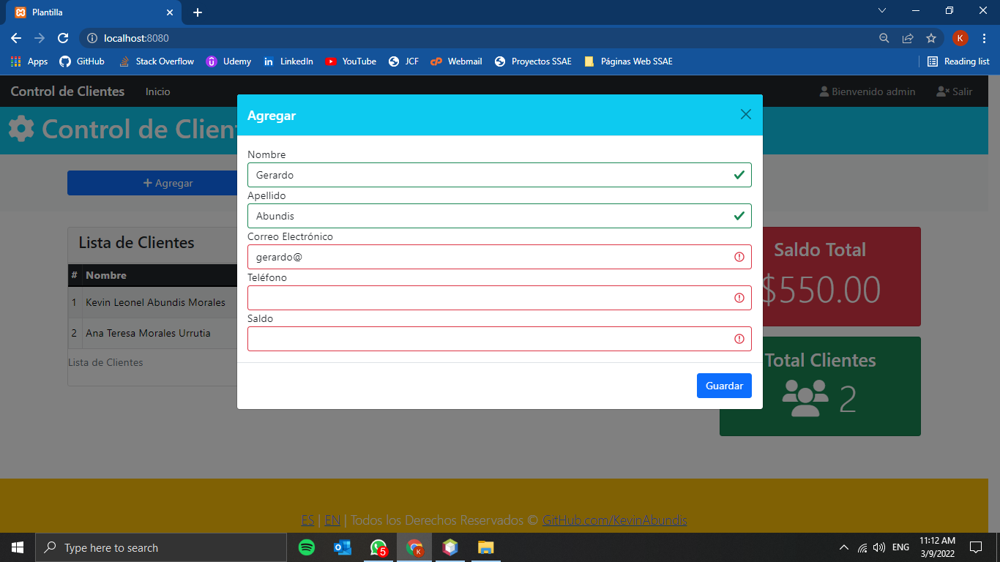
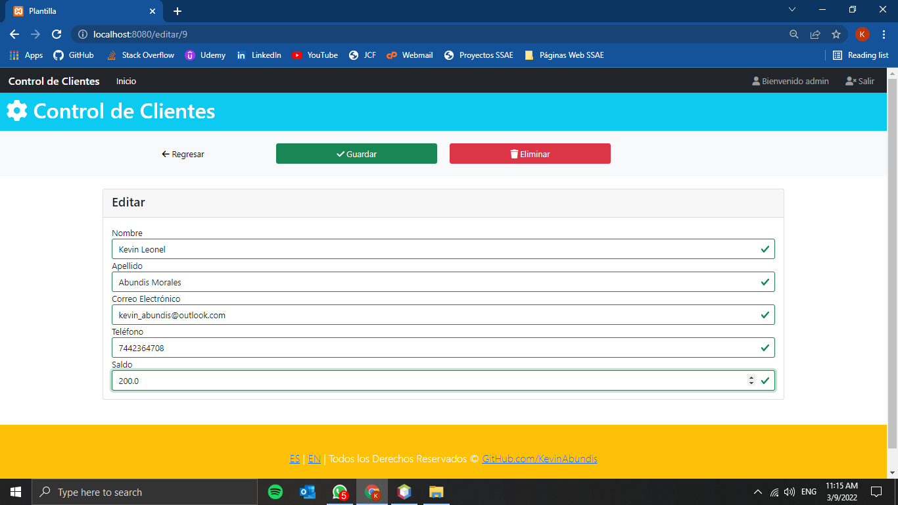
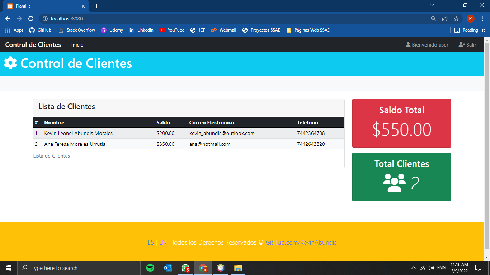
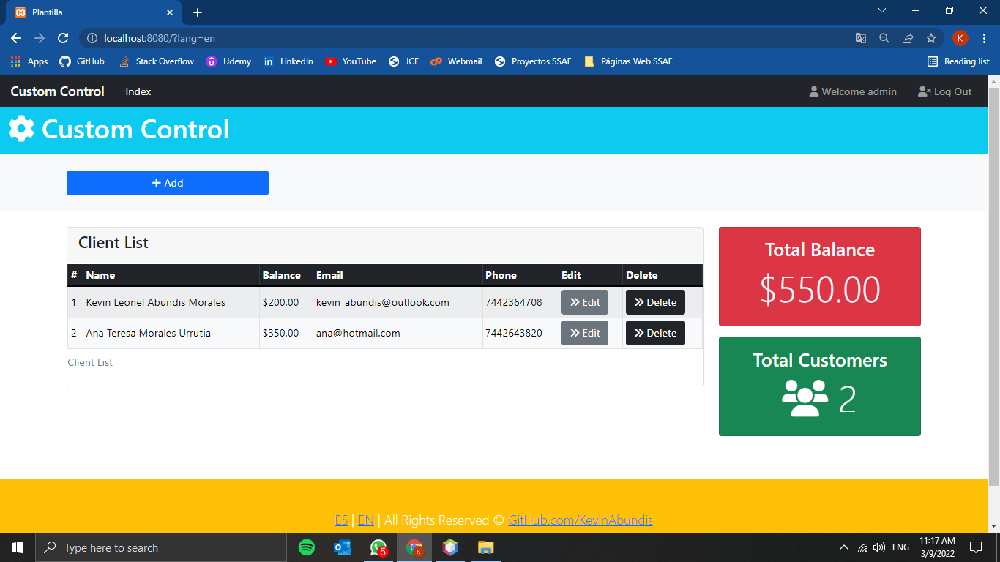
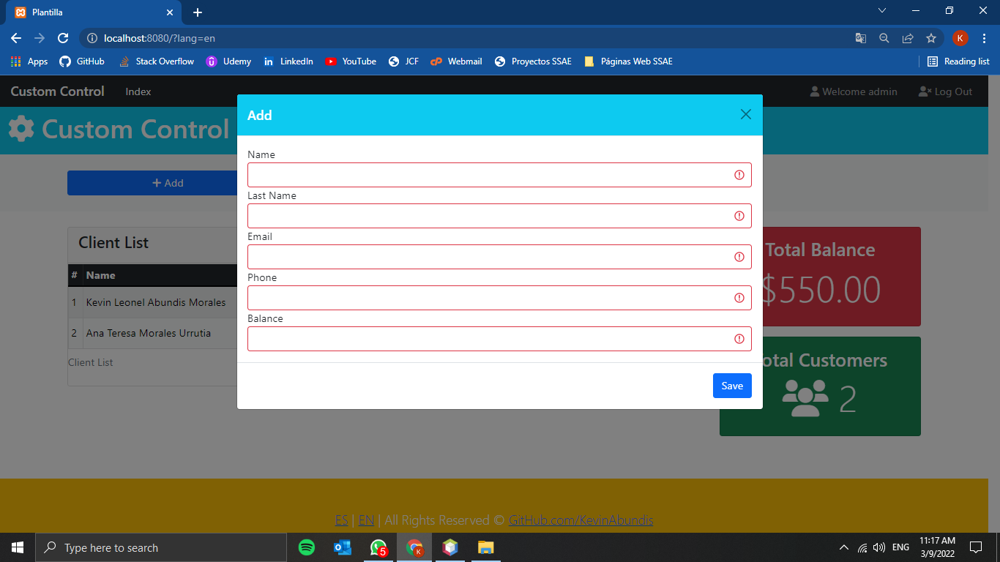
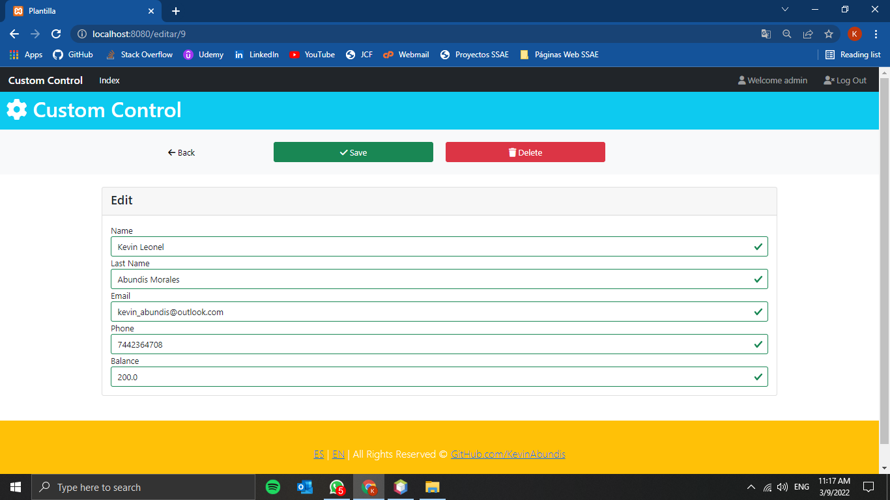
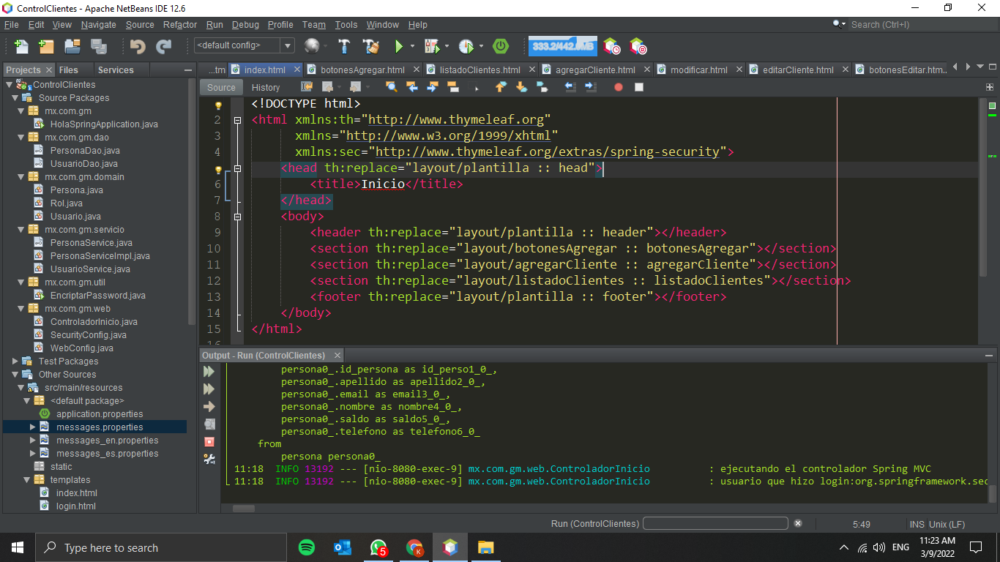
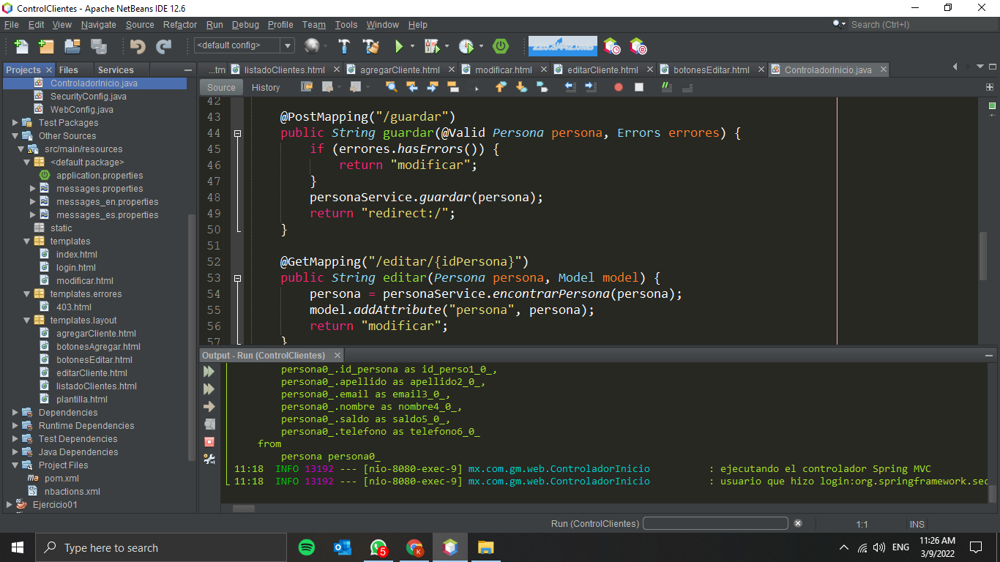

## Control de Clientes con Spring Framework y Spring Boot 

**Inicio de Sesión**

**Página Principal - Vista Admin**

**Agregar Cliente**

**Modificar Cliente**

**Página Principal - Vista Usuario**

**Internacionalización - Manejo de Idiomas**

**Organización de Carpetas del Proyecto - Apache Netbeans**

**Diagrama ER - MySQL Workbench**

**Tabla persona - MySQL Workbench**

**Tabla usuario - MySQL Workbench**

**Tabla rol - MySQL Workbench**
